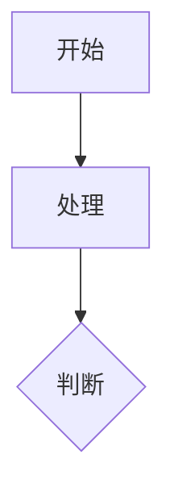

## 快速开始

### 环境要求

- Node.js 18+
- pnpm

### 三步启动

```bash
git clone https://github.com/your-username/echoes.git
cd echoes && pnpm i
pnpm run dev  # 访问 http://localhost:4321
```

### 一键部署

[](https://vercel.com/new/clone?repository-url=https://github.com/lsy2246/newechoes)

## 核心功能

### 文章系统

**创建文章（推荐方式）：**

```bash
chmod +x create_post.sh  # 首次使用
./create_post.sh "文章标题" "目录/文章路径"
```

**手动创建：** 在 `src/content/articles` 目录下创建 `.md` 文件

```markdown
---
title: "文章标题"
date: YYYY-MM-DD
tags: ["标签1", "标签2"]
---

文章内容...
```

### RSS 订阅

自动为所有文章生成 `/rss.xml` 订阅源，无需额外配置。

### Mermaid 图表

支持在文章中直接使用 Mermaid 图表：

````markdown

````

### 页面过渡与性能

- **View Transitions API** 与 **Swup** 实现流畅的无刷新切换
- **WebAssembly** 优化前端数据处理性能
- **SEO 优化**：自动生成元标签和站点地图
- **响应式设计**：自适应桌面和移动端

## 基础配置

编辑 `src/consts.ts` 配置网站信息：

```typescript
export const SITE_URL = "https://your-domain.com";
export const SITE_TITLE = "你的网站名称";
export const SITE_DESCRIPTION = "网站描述";

// 导航结构
export const NAV_STRUCTURE = [
  { id: "home", text: "首页", href: "/" },
  {
    id: "articles",
    text: "文章",
    items: [
      { id: "filter", text: "筛选", href: "/filtered" },
      { id: "path", text: "网格", href: "/articles" },
    ],
  },
];
```

## 可选功能模块

### 文章过期提醒

在 `src/consts.ts` 中配置：

```typescript
export const ARTICLE_EXPIRY_CONFIG = {
  enabled: true,
  expiryDays: 365,
  warningMessage: "文章内容可能已过时",
};
```

### 项目展示

使用 `@/components/GitProjectCollection` 展示 Git 平台项目：

```astro
<GitProjectCollection
  platform={GitPlatform.GITHUB}
  username="your-username"
  title="我的项目"
  client:load
/>
```

### 豆瓣数据集成

使用 `@/components/DoubanCollection` 展示观影和读书记录：

```astro
// 观影记录
<DoubanCollection type="movie" title="看过的电影" doubanId="your-id" />
// 读书记录
<DoubanCollection type="book" title="读过的书" doubanId="your-id" />
```

### 微信读书书单

使用 `@/components/WereadBookList` 展示书单：

```astro
<WereadBookList listId="12345678" client:load />
```

从分享链接获取 ID：`https://weread.qq.com/misc/booklist/12345678`

### 旅行足迹

使用 `@/components/WorldHeatmap` 展示全球足迹：

```astro
<WorldHeatmap
  client:only="react"
  visitedPlaces={["中国-北京", "美国", "日本"]}
/>
```

## 故障排除

| 问题             | 解决方案                   |
| ---------------- | -------------------------- |
| 图片显示问题     | 确保图片放在 `public` 目录 |
| 豆瓣数据无法加载 | 检查用户 ID，确认记录公开  |
| Git 项目无法显示 | 验证用户名和 API 访问权限  |
| WebAssembly 报错 | 检查浏览器支持和 CSP 设置  |
